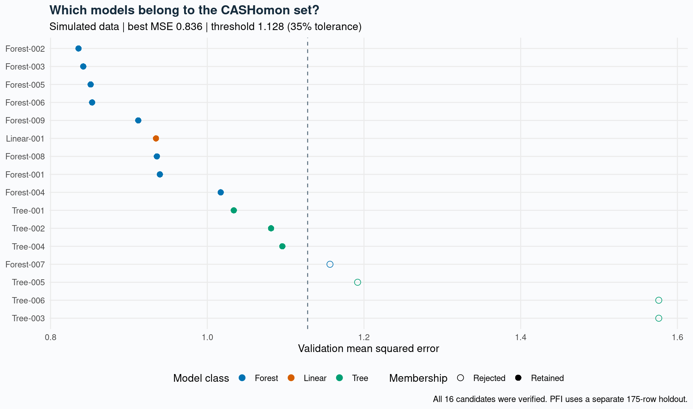
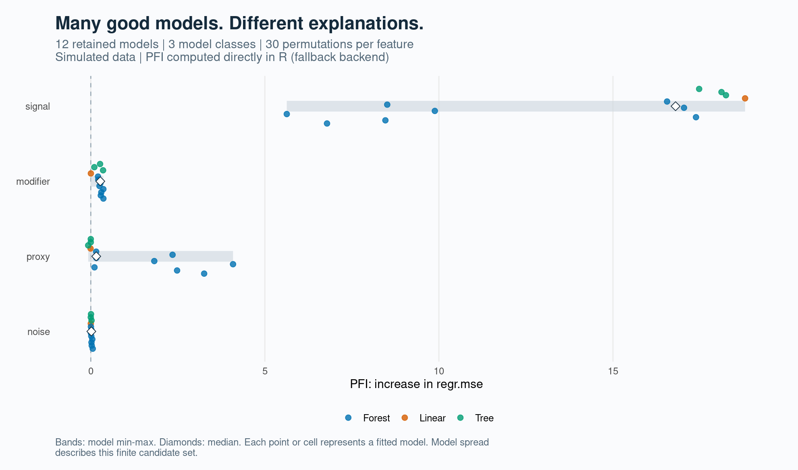
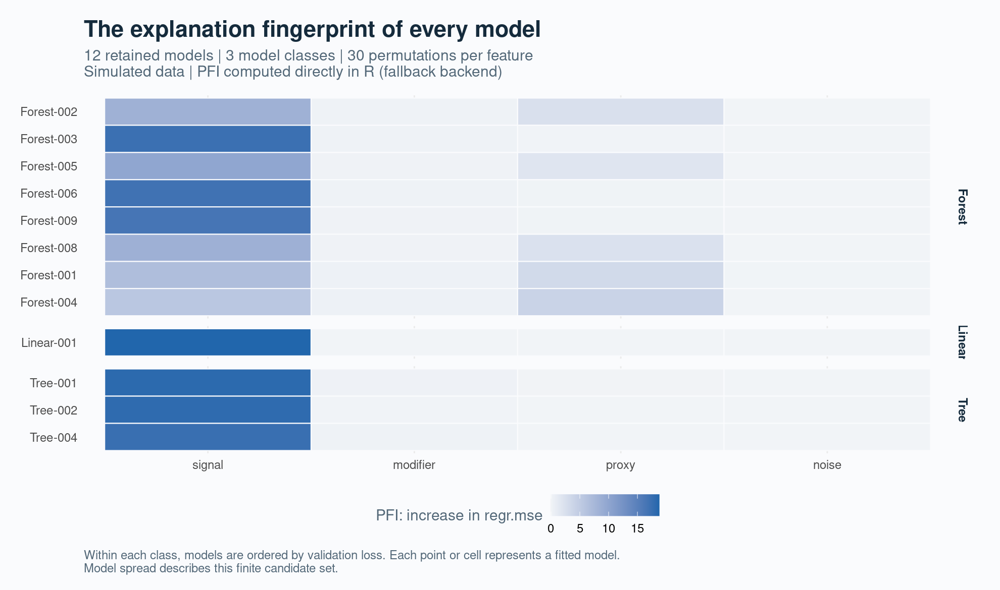
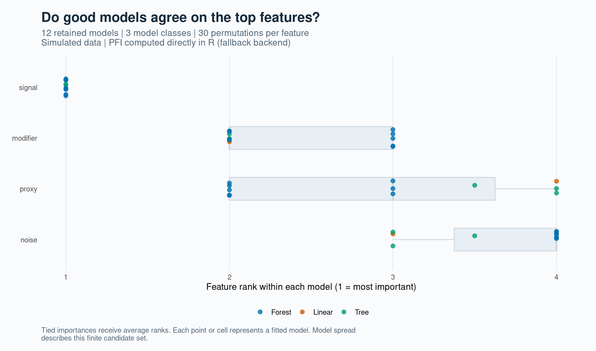
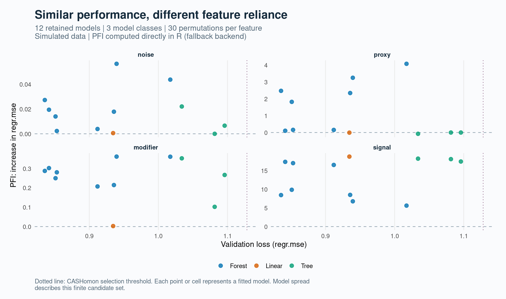
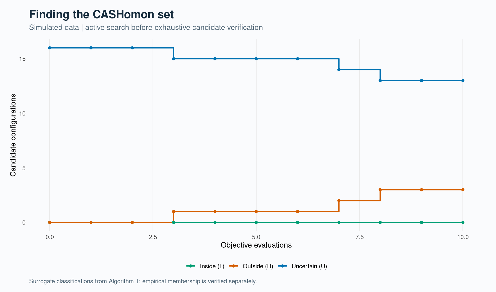

# Demonstration results: direct-R PFI

These are computed results from fitted models on simulated data, not plot fixtures.
PFI was computed directly in R because xplainfi was unavailable. These are not xplainfi outputs.

## Run

- Candidates: 16 across linear regression, decision trees, and random forests.
- TruVaRImp evaluations: 10; additional verification fits: 6.
- Retained: 12 models from 3 model classes.
- Validation MSE: best 0.835628; membership threshold 1.128098 (35% relative tolerance).
- Disjoint partitions: 350 training rows, 175 validation rows, 175 PFI holdout rows.
- PFI: 30 permutations per feature, 48 model-feature means, 1440 individual scores.

## Findings

| Feature | Minimum mean PFI | Median mean PFI | Maximum mean PFI |
|---|---:|---:|---:|
| signal | 5.6299 | 16.7978 | 18.7952 |
| modifier | 0.0027 | 0.2739 | 0.3620 |
| proxy | -0.0748 | 0.1569 | 4.0861 |
| noise | 0.0000 | 0.0159 | 0.0565 |

PFI is the increase in holdout MSE after permutation. All permutations use retained fits without retraining.
The signal and proxy are correlated by construction. Ranges describe this finite set; they are not confidence intervals or population-risk guarantees.

## Figures













Each figure is also available as a PDF with the same basename.

## Reproduce and audit

From the repository root, after installing cashomon, rpart, ranger and ggplot2:

```sh
Rscript inst/examples/offline-workflow.R
```

The CSV files contain every candidate, set member, permutation score, holdout prediction, simulated row, and permutation donor assignment.
[Raw observations](simulated-data.csv) are also bundled in `inst/extdata/simulated-data.csv`; see the [data dictionary](../../inst/extdata/README.md).
See `run-summary.csv` for seeds/settings and `session-info.txt` for package versions.
`workflow.rds` retains fitted objects locally and is ignored by Git; rerun the script to recreate it.

For the requested xplainfi implementation, install its dependencies and run `inst/examples/workflow.R`.
Its outputs are written to the parent artifacts directory so backend provenance stays explicit.
